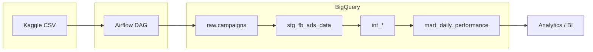

# Advertisement Campaign Analytics Pipeline

---

## Overview

This project demonstrates a complete data pipeline that ingests advertising campaign data from Kaggle, loads it into Google BigQuery, and transforms it using dbt for analytics-ready insights. Raw data lands in a dedicated dataset; staging, intermediate, and mart models are built with dbt for reporting and BI.

---

## Tech Stack & Tools

- **Apache Airflow** — Workflow orchestration and scheduling
- **Google BigQuery** — Cloud data warehouse for storage and querying
- **dbt (Data Build Tool)** — Data transformation and modeling
- **Docker** — Containerization for reproducible deployments
- **Python** — ETL scripting (Kaggle API, kagglehub, pandas)
- **uv** — Fast Python dependency resolution (Dockerfile)

---

## Architecture

Data flows from Kaggle (CSV) into an Airflow DAG, which creates the BigQuery raw dataset and loads the file. dbt then builds staging, intermediate, and mart tables in BigQuery for analytics.


---

## Project Structure

```
├── dags/                          # Airflow DAG definitions
│   └── ad_campaign_pipeline.py
├── bigquery/                      # BigQuery ETL scripts
│   └── load_kaggle_data.py
├── dbt/                           # dbt project
│   ├── models/
│   │   ├── staging/               # Sources + stg_fb_ads_data
│   │   ├── intermediate/         # int_campaign_*, int_daily_*, int_demographic_*, int_interest_*
│   │   └── marts/                # mart_daily_performance
│   ├── macros/                   # fix_shifted_rows, performance_metrics
│   ├── profiles.yml
│   ├── packages.yml              # dbt_utils
│   └── dbt_project.yml
├── keys/                          # Credentials (gitignored)
├── docker-compose.yml
├── Dockerfile
├── pyproject.toml
└── script.sh                      # Run commands in container
```

---

## Prerequisites

- **Docker** and **Docker Compose**
- **Google Cloud** account with BigQuery enabled
- **GCP service account** JSON (BigQuery Data Editor) and **Kaggle** API token (`kaggle.json`)

---

## Getting Started

1. **Credentials** — Place under `keys/` (gitignored): `keys/gcp-service-account.json`, `keys/kaggle.json`

2. **dbt connection** — Edit `dbt/profiles.yml` and set `project` (GCP project ID) and `dataset` (e.g. `ad_campaign_analytics`). The loader reads the project from this file.

3. **Start the pipeline**
   ```bash
   docker compose up --build
   ```
   Open **http://localhost:8080** (login: `admin` / `admin`). Unpause the DAG **`ad_campaign_data_pipeline`** and trigger a run to load raw data into BigQuery.

4. **Run dbt** (after at least one successful ingestion)
   ```bash
   docker compose run --rm airflow dbt deps   --project-dir /opt/dbt --profiles-dir /opt/dbt
   docker compose run --rm airflow dbt run   --project-dir /opt/dbt --profiles-dir /opt/dbt
   docker compose run --rm airflow dbt test --project-dir /opt/dbt --profiles-dir /opt/dbt
   ```
   On Linux/macOS: `./script.sh dbt run --project-dir /opt/dbt --profiles-dir /opt/dbt`. On Windows use Git Bash/WSL or the commands above.

---

## Data Layers & Presentation

- **Raw (`ad_campaign_raw.campaigns`)** — Payloads from Kaggle; append, schema autodetect.
- **Staging (`stg_fb_ads_data`)** — Cleaning (fix shifted rows), derived metrics (CTR, CPC, CPM, conversion rates). Single source for downstream.
- **Intermediate (`int_*`)** — Aggregations by campaign, day+gender, demographic, interest; reusable macros.
- **Mart (`mart_daily_performance`)** — Analytics-ready: daily performance, monthly benchmarks, tiers, optimization recommendations.

**Conventions:** Prefix models `stg_`, `int_`, `mart_`; use dbt tests and docs in YAML.

---

## Key Features

- **Automated ingestion** — Weekly DAG (Mon 6 AM UTC): dataset creation + Kaggle → BigQuery (append, autodetect).
- **Layered dbt models** — Staging → intermediate → mart with tests and macros; idempotent runs.
- **Containerized** — Docker Compose + custom Airflow image (uv, pyproject.toml); volume mounts for live code.
- **Auth & config** — GCP and Kaggle credentials via `keys/`; dbt profile for project/dataset.

---

## Skills Demonstrated

- Cloud data warehousing (BigQuery) · Workflow orchestration (Airflow) · Containerization (Docker)
- ETL/ELT design · API integration (Kaggle, GCP) · Infrastructure as Code
- dbt (layered models, tests, macros) · Data modeling and documentation

---

## License

Use and adapt as needed for your environment.
